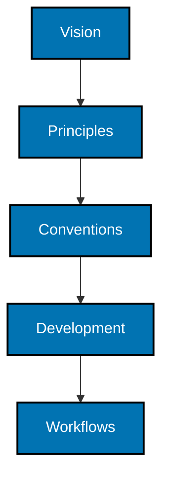

# Repository Governance

This directory holds RHINO's rules and working agreements. Root [`AGENTS.md`](../AGENTS.md) is an index into it and states no rule of its own.

Every directory here follows the [directory-map convention](conventions/directory-maps.md).

## Governance Hierarchy

A lower level may not contradict a higher one. Higher levels need not conform to lower ones. When two documents conflict the higher level wins and the lower one changes. Link to a higher rule rather than restating it.

## Where These Rules Came From

They were extracted from a sibling repository's governance tree and adapted here. Roughly a third of that tree was rejected outright: it describes a live service, a database, a browser, and a workspace task runner, none of which exist in a Rust CLI. What survived was rewritten against this repository's own rules rather than copied over them.

**Nothing keeps the copies synchronized, and that is the decision rather than an oversight.** The only shared contract is the machine-checked one: [`repo-config.yml`](../repo-config.yml) and the validator each repository runs. A future reader finding three different phrasings of the integration path should read that as three repositories having decided, not as one having decayed. [Rules propagation](workflows/rules-propagation.md) stops at this repository's boundary for the same reason.

## Word Budget

Root `AGENTS.md` is limited to 650 words and every document here to 750, enforced by [`repo-config.yml`](../repo-config.yml). The budget is a maximum, not a target. A document that outgrows it is split into coherent documents with distinct reader tasks; the budget is never raised to fit it and substance is never trimmed to fit the budget.

## Directory Map

- [Vision](vision/README.md) — the future this repository exists to create.
- [Principles](principles/README.md) — durable constraints within that vision.
- [Conventions](conventions/README.md) — repository-wide choices within the vision and principles.
- [Development](development/README.md) — engineering standards within all higher levels.
- [Workflows](workflows/README.md) — repeatable procedures, which may compose other workflows.
