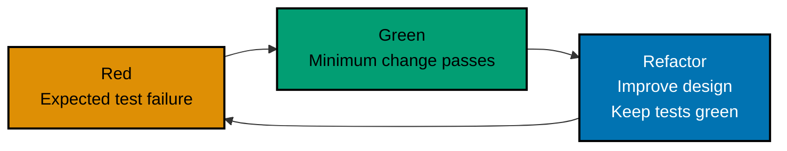

# Red, Green, Refactor

Use this workflow for each behaviour increment required by [test-driven development](../development/test-driven-development.md).

## Prerequisites

- Assess `specs/behaviours/` and `specs/architecture.md` for impact first, under [specification maintenance](../development/specification-maintenance.md). The Gherkin comes before the test that binds it.
- Identify the smallest observable behaviour to add or change.
- Identify the narrowest test target that can demonstrate it.

## Cycle



Colour distinguishes the three phases only; the labels carry the meaning.

1. **Red.** Write or change one test expressing the intended behaviour. Run the narrowest target and confirm it fails **because the behaviour is absent**. A failure from a missing binding, a wrong fixture, or a compile error is not red — repair that first.

   ```sh
   cargo test --test unit <filter>
   ```

2. **Green.** Make the minimum production change for that test. Run the same target and confirm the new test and its neighbours pass. Change nothing else while red-to-green is in flight.

3. **Refactor.** Improve names, structure, and duplication without adding behaviour, running the target after each meaningful step.

4. Repeat for the next increment.

## Verification

After the final cycle, run the quick gate:

```sh
./hippo run --class ephemeral --disk-path . -- cargo xtask test-quick
```

The completed work must carry evidence of the expected red failure and the final green result. If the harness itself is broken, repair it first — an unrelated failure is not evidence that a behaviour test is valid.
