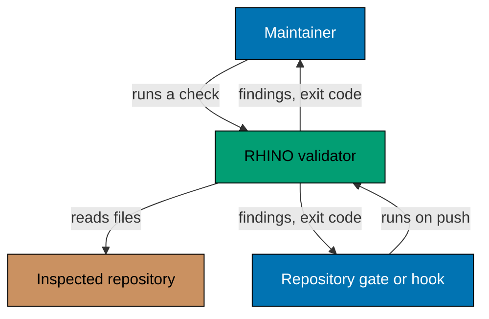
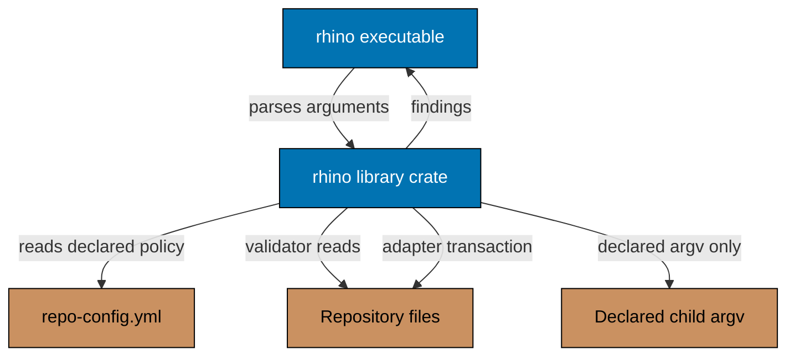
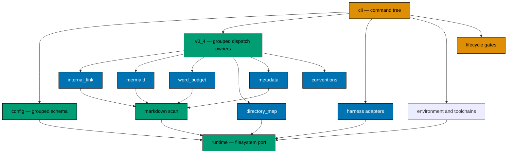

# RHINO Architecture

The as-built C4 model for the RHINO command-line validator. Behaviour lives in [`behaviours/`](behaviours/README.md); this file describes structure. Where the two disagree, the scenarios are canonical and this file is wrong.

## Scope

RHINO validates one repository's Markdown, instruction files, and harness adapters against declared policy. Explicit gate, toolchain, and adapter commands use separately injected process or transaction ports; ordinary tree validation remains a single short-lived, read-only process.

Four constraints shape every box below, and none of them is a convention that could be relaxed later:

- **Read-only validation.** A validator opens no file for writing inside the inspected tree.
- **Network-free.** RHINO opens no socket, including loopback. External URLs found in Markdown are recognized and skipped, never fetched.
- **Bounded process launch.** `gate run` and toolchain operations start only declared argv through separate ports.
- **Bounded adapter mutation.** Only generation receives an adapter-store port; it replaces declared roots only after a complete lossless plan exists.

## System Context

A gate and a maintainer are the same caller from RHINO's side: both pass arguments and read an exit code. The tool has no notion of who invoked it, which is why its output has to be legible to a human and parseable by a script from the same run.

## Containers

The split between the binary and the library is not stylistic. Rust links integration tests under `tests/` against a crate's library target only, so a binary-only crate would have forced the behaviour corpus into `#[cfg(test)]` modules inside `src/` — which is exactly the boundary the specification standard forbids. The library holds every decision; the binary holds argument parsing, output writing, and the exit code.

## Components

Every validator reaches the filesystem through one port trait rather than through `std::fs` directly. That is what makes the unit adapter able to drive the whole corpus against an in-memory tree, and it is also the seam the read-only constraint is enforced at: the port exposes no write operation, so a validator cannot write even by mistake.

The Markdown validators share one scan so the tree is walked once per invocation.
Directory maps use the declared directory projection; harness adapters use their
own named inputs and transaction boundary.

The grouped `v0_4` boundary owns the stable validation, lifecycle, adapter, and
operation paths. `gates` dispatches declared children through the launcher port.
`v0_4::operations` owns environment transactions and the separate toolchain
runner port; it starts only declared typed argv, without a shell or reported
child output.

## Data

RHINO owns no persistent store. Its inputs are the declared configuration and the inspected tree; its outputs are a findings report on stdout and an exit code. Nothing survives the process.

`repo-config.yml` is owned by the consuming repository, not by RHINO. RHINO ships no default for any value in it: a repository that declares nothing gets a configuration error rather than a borrowed assumption from whichever repository the author had in mind.

## Boundaries

| Boundary        | Where it is                                              | How it is held                                       |
| --------------- | -------------------------------------------------------- | ---------------------------------------------------- |
| Process         | The `rhino` executable's argument and exit-code contract | Observed by the E2E adapter, which sees nothing else |
| Filesystem      | The port trait in `runtime`                              | Substituted wholesale by the unit adapter            |
| Host process    | Launcher and toolchain-runner ports in `runtime`         | Declared typed argv only; no shell or output report  |
| Repository root | Every resolved path                                      | Paths that escape the root are refused, not clamped  |
| Trust           | The inspected tree is untrusted input                    | Linear-time matching only; no backtracking engine    |

The trust boundary is the one most easily lost. RHINO matches patterns against Markdown a repository committed, so a pattern engine that can backtrack catastrophically would let content hang the gate. That is why the regex engine is chosen for its linear-time guarantee and why three patterns are hand-written parsers rather than being made to fit a more expressive engine.
